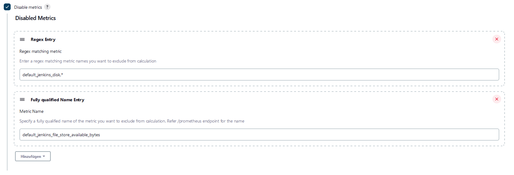

# Plugin configuration

This page is under construction.

## Disable Metrics (since v2.3.0)
Sometimes you don't need all metrics in your prometheus endpoint which this plugin provides. 
You can disable certain metrics. These metrics are not being collected by the plugin and therefore not added in the 
prometheus endpoint.
A

### Regex Entry
A Regex entry can be used to disable a group of metrics. E.g. if you want to disable everything with 
default_jenkins_disk.*

### Fully qualified Name Entry
If you want to disable certain individual entries you can do it with this entry. The value should be the same
as you can see it in the prometheus endpoint. It's case-insensitive.
